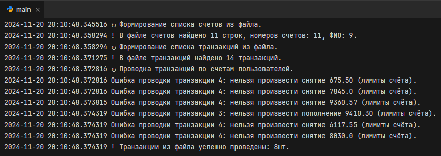
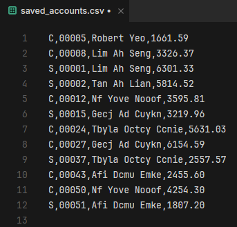

## Проектное задание: банковские счета
Приложение: λambda Bank\
Выполнил: Михайленко Петр Евгеньевич, 2024г.\
**Для запуска программы необходимо запустить файл main.py в корневой директории.**

### Содержание ###
[1. Техническое задание](#1-техническое-задание)\
[2. Функции программы](#2-функции-программы)\
[3. Листинг программы](#3-листинг-программы)\
[4. Примеры работы программы](#4-примеры-работы-программы)\
[5. Список используемых информационных источников](#5-список-используемых-информационных-источников)

### 1. Техническое задание

#### 1.1. Наименование
Полное наименование системы: Банковские счета (λambda Bank)\
Условное обозначение системы – программа.

#### 1.2. Основание для разработки
Программный продукт создаётся на основе личной инициативы и задания.

#### 1.3. Наименование заказчика и разработчика
Заказчик: Московский государственный университет имени М.В. Ломоносова (МГУ), Факультет вычислительной математики и кибернетики (ВМК).\
Разработчик: Михайленко Петр Евгеньевич.

### 1.4. Назначение и цели разработки

#### 1.4.1. Назначение программного обеспечения
Разработка ПО «Банковские счета: (λambda Bank)» является автоматизацией процедуры проведения транзакций для клиентов банка, вывода сводной информации по счетам.

#### 1.4.2. Цели создания программного обеспечения
Основной целью создания ПО «Банковские счета» является автоматизация процедуры транзакций банковских счетов пользователя.\
В соответствии с поставленной целью, создаваемая система должна уметь решать следующие задачи:\
- Считывание из файла счетов;
- Считывание из файла транзакций;
- Хранение и обработка считанных данных в памяти в виде списков;
- Сохранение списков счетов в файл;
- Учитывать лимиты по счетам: минимальный и максимальный остаток и отслеживание лимитов при проведении транзакций.

### 1.5. Задачи, подлежащие решению
- Исследование предметной области;
- Разработка структуры программы;
- Разработка функциональной модели;
- Разработка алгоритмов и функций;
- Программная реализация;
- Тестирование;
- Разработка документации к программе.

### 1.6. Требования к разработке

#### 1.6.1 Требования к функциональным характеристикам
Программа должна выполнять следующие функции:\

1. Запуск программы;
2. Работа программы при добавлении записей в файлы данных;
3. Сохранение счетов и пользователей в виде списков;
4. Для пользователей сохраненных в виде списков проведение транзакций различного вида и вывода результата на экран (в консоль);
5. Сохранение списка счетов в файл;
6. Отслеживание лимитов по счетам (минимальный и максимальный остаток).

#### 1.6.2. Минимальные требования к составу технических средств
- Оперативная память 1 ГБ;
- Жесткий диск 64 МБ;
- Процессор 1 ядро с частотой 1,3 ГГЦ;
- Графический вывод для взаимодействия с консолью;
- Наличие устройтв ввода для взаимодействия с консолью;

#### 1.6.3 Требования к составу программных средств
Для работы программы на компьютере или ноутбуке пользователя требуется:\
- Операционная система: Windows(32/64 Bit) / MAC OS / Linux;
- Интерпретатор: поддерживающий версию Python 3.12 или более свежую;
- Командная строка: CMD / Terminal / IDE PyCharm / Fleet;

#### 1.6.4 Требования к программным компонентам
Основным требованием к программным компонентам является корректное исполнение функций, заявленных в пункте [2.6.1](#261-требования-к-функциональным-характеристикам).

### 1.7. Требования к входным и выходным данным.
Все входные данные вносятся в файлы `accounts.csv` и `transactions.csv` в каталоге `database/original`.\
Входные данные:

Файл `accounts.csv` - список счетов пользователей:
- Тип счёта пользователя (C - текущий счёт, S - сберегательный счёт)
- Номер счёта пользователя;
- ФИО пользователя;
- Баланс на счету пользователя;

Файл `transactions.csv` - список транзакций по счетам:
- Дата операции транзакции;
- Тип счёта пользователя (C - текущий счёт, S - сберегательный счёт)
- № счёта пользователя;
- Тип операции (D - пополнить; W - снять).

Все выходные данные выводятся в консоль.

### 1.8. Этапы разработки
Разработка программы выполняется по этапам, представленным в таблице.\
Таблица 1. Этапы разработки\

| № | Наименование этапа и содержание работ | Сроки исполнения |
|---|---------------------------------------|------------------|
| 1 | Разработка и утверждение ТЗ           | Ноябрь 2024 г.   |
| 2 | Исследование предметной области       | Ноябрь 2024 г.   |
| 3 | Разработка структуры                  | Ноябрь 2024 г.   |
| 4 | Создание программы                    | Ноябрь 2024 г.   |
| 5 | Оформление документации               | Ноябрь 2024 г.   |
| 6 | Защита работы                         | Ноябрь 2024 г.   |

### 1.9. Техническая документация, предъявляемая по окончании работы
1. Техническое задание.
2. Листинг программы.
3. Отчёт.

### 1.10. Порядок приема работы
Приём и контроль программного изделия осуществляется в соответствие с методикой испытаний.

### 1.11. Дополнительные условия
Данное техническое задание может дополняться и уточняться в установленном порядке.

## 2. Функции программы
Функции программы должны покрывать пункт технического задания [1.4.2. Цели создания программного обеспечения](#142-цели-создания-программного-обеспечения)

## 3. Листинг программы

### 3.1. Исполняемые файлы
#### 3.1.1. Основной исполняемый файл
```main.py
from src.lambda_bank import LambdaBank

# Получаем экземпляр класса приложения.
lambda_bank = LambdaBank(True) # True, 1

# 1. Запустить приведенную программу.
print('1. Запустить приведенную программу.')
lambda_bank.start()
print()

# 2. Добавить в каждый файл 5-8 записей и проверить работу.
print('2. Добавить в каждый файл 5-8 записей и проверить работу.')
# 2.1. Добавление записей.
lambda_bank.generate_files_records(5, 8)
# 2.2. Проверка работы (проводка транзакций из файла).
lambda_bank.carry_out_transactions_from_file()
print()

# 3. Сохранить счета и пользователей в виде списков.
print('3. Сохранить счета и пользователей в виде списков.')
# 3.1. Сохранение счетов в виде списков.
account_numbers = lambda_bank.save_accounts_numbers_to_list()
print('Список счетов: ', account_numbers)
# 3.2. Сохранение пользователей в виде списков.
users_names = lambda_bank.save_users_to_list()
print('Список пользователей: ', users_names)
print()

# 4. Для пользователей сохраненных в виде списков провести 10-15 транзакций различного вида вывести результат на экран.
print('4. Для пользователей сохраненных в виде списков провести 10-15 транзакций различного вида вывести результат на экран.')
# 4.1. Генерация и проводка 10-15 транзакций.
lambda_bank.carry_out_random_users_transactions(10, 15)
# 4.2. Вывод результата на экран.
lambda_bank.display_monthly_statements()
print()

# 5. Добавить метод сохранения списка счетов в файл.
print('5. Добавить метод сохранения списка счетов в файл.')
lambda_bank.save_users_accounts_to_file()
print()

# 6. Добавить лимиты по счетам: минимальный и максимальный остаток и отслеживание лимитов при проведении транзакций.
print('6. Добавить лимиты по счетам: минимальный и максимальный остаток и отслеживание лимитов при проведении транзакций.')
# 6.1. Генерируем транзакцию с большой суммой для проверки лимитов
big_transaction = lambda_bank.generate_transaction(result_type='Transaction', transaction_amount='20000.00', transaction_type='W')
# 6.2. Добавляем транзакцию в список обработки.
lambda_bank.add_transaction(big_transaction)
# 6.3. Проводим сгенерированную транзакцию.
lambda_bank.carry_out_transactions()
print()
```

#### 3.1.2. Основной модуль банковских счетов
``` /src/lambda_bank.py
import random, datetime
from decimal import Decimal
from time import sleep

from account import Account
from src import reader
from transcation import Transaction


class LambdaBank:
    """ Основной класс для запуска приложения. """

    def __init__(self, logging: bool = False, logging_pause: int = 0):
        """
        Инициализация приложения LambdaBank.

        Parameters
        ----------
        logging : bool = True
            Ведение логов основного потока приложения.

        logging_pause : int = 1
            Пауза после логирования приложения. Только эстетический эффект.

        """

        # Настройки приложения.
        self.__title = 'λambda Bank'  # Название приложения.

        # Возможные типы банковских счетов.
        self.__account_types = (
            'S',  # Сберегательный счёт.
            "C",  # Текущий счёт.
        )

        # Возможные типы транзакций.
        self.__transactions_types = (
            'W',  # Снятие (расходная операция).
            "D",  # Пополнение (доходная операция).
        )

        # Пути для файлов данных (для сессии программы создаются свои файлы из оригинальных).
        self.__original_accounts_file_path = 'database/original/accounts.csv'  # Оригинальный файл данных счетов.
        self.__original_transactions_file_path = 'database/original/transactions.csv'  # Оригинальный файл данных транзакций.
        self.__session_accounts_file_path = 'database/session/accounts.csv'  # База данных счетов сессии приложения.
        self.__session_transactions_file_path = 'database/session/transactions.csv'  # Оригинальный файл данных транзакций.

        # Путь до файла для сохранения списка счетов.
        self.__session_accounts_file_path = 'database/session/saved_accounts.csv'  # Оригинальный файл данных транзакций.

        # Настройки логирования (опционально).
        self.__logging = logging  # Включить логирование.
        self.__logging_pause = logging_pause  # Пауза между выводом.

        # Существующие аттрибуты класса.
        self.__accounts = None  # Список счетов CurrencyAccount | SavingAccount.
        self.__accounts_numbers = None  # Уникальный список номеров счетов пользователей.
        self.__users_names = None  # Уникальный список ФИО пользователей.
        self.__transactions = []  # Список транзакий ожидающих обработки.
        self.__completed_transactions = []  # Список обработанных транзакий.

    def start(self):
        self.log(f'! Старт приложения "{self.__title}".')
        self.prepare_session_files()

    def prepare_session_files(self):
        """
        Процедура подготовки файлов сессии для работы.
        Копирует изначальные файлы `original` в `session` для работы с ними.
        Исходные и конечные файлы задаются при инициализации __init__.
        """

        # Копирование файла счетов.
        self.log(f'↻ Файл счетов копируется.')
        reader.copy_file(self.__original_accounts_file_path, self.__session_accounts_file_path)

        # Копирование файла транзакций.
        self.log(f'↻ Файл транзакий копируется.')
        reader.copy_file(self.__original_transactions_file_path, self.__session_transactions_file_path)

        self.log(f'! Все файлы успешно подготовлены.')

    def add_transaction(self, transaction: Transaction):
        """ Добавяление транзакции в список транзакций к обработке. """
        self.__transactions.append(transaction)

    def carry_out_transactions(self):
        """
        Проводка транзакций в списке ожидания проводки.

        Returns
        -------
        int
            Количество проведённых транзакций.
        """

        # Количество проведённых транзакций.
        number_of_carry_out_transactions = 0

        # Перебираем список транзакий в ожидании.
        while len(self.__transactions) > 0:
            # Берём самую первую транзакцию.
            current_transaction = self.__transactions.pop(0)

            # Проводка транзакции.
            if self.carry_out_transaction(current_transaction):
                # Проведённую транзакцию переносим в список завершённых.
                self.__completed_transactions.append(current_transaction)

                # Запись количества проведённых транзакций.
                number_of_carry_out_transactions += 1

        # Возврат количества проведённых транзакций.
        return number_of_carry_out_transactions

    def get_account(self, account_number: str) -> Account | None:
        """
        Поиск счёта по номеру счёта.

        Parameters
        ----------

        account_number : str
            Номер счёта.

        Returns
        -------
        CurrentAccount | SavingAccount | None
            Счёт пользователя, если найден.
        """

        # Поиск по номеру счёта в списке счетов.
        for account in self.__accounts:
            if account.get_account_number() == account_number:
                return account

        # Счёт не найден.
        return None

    def carry_out_transaction(self, transaction: Transaction):
        """
        Проводка одной транзакции.

        Returns
        -------
        bool
            Успешность проводки транзакции.
        """

        # Проверка транзакции на существование типа.
        transaction_type = transaction.get_transaction_type()
        if transaction_type not in self.__transactions_types:
            self.log(f'Ошибка проводки транзакции 1: тип транзакции {transaction_type} не найден.')
            return False

        # Поиск аккаунта пользователя из транзакции.
        account = self.get_account(transaction.get_account_number())
        if not account:
            self.log(f'Ошибка проводки транзакции 2: счёт транзакции {account} не найден.')
            return False

        # Списание или пополнение в зависимости от типа.
        if transaction_type == 'D':  # Пополнение.
            if not account.deposit(transaction.get_transaction_amount()):
                self.log(
                    f'Ошибка проводки транзакции 3: нельзя произвести пополнение {transaction.get_transaction_amount()} (лимиты счёта).')
                return False
        elif transaction_type == 'W':  # Снятие.
            if not account.withdraw(transaction.get_transaction_amount()):
                self.log(
                    f'Ошибка проводки транзакции 4: нельзя произвести снятие {transaction.get_transaction_amount()} (лимиты счёта).')
                return False

        # Успешная проводка транзакции.
        return True

    def carry_out_transactions_from_file(self):
        """
        Проводка транзакций из файла сессии.
        """

        # Получаем список счетов.
        self.log('↻ Формирование списка счетов из файла.')
        self.__accounts, self.__accounts_numbers, self.__users_names = reader.read_accounts(
            self.__session_accounts_file_path)
        self.log(
            f'! В файле счетов найдено {len(self.__accounts)} строк, номеров счетов: {len(self.__accounts_numbers)}, ФИО: {len(self.__users_names)}.')

        # Получаем список транзакций.
        self.log('↻ Формирование списка транзакций из файла.')
        self.__transactions = reader.read_transactions(self.__session_transactions_file_path)
        self.log(f'! В файле транзакций найдено {len(self.__transactions)} транзакций.')

        # Проводим все транзакции по счетам.
        self.log('↻ Проводка транзакций по счетам пользователей.')
        number_carry_out = self.carry_out_transactions()
        self.log(f'! Транзакции из файла успешно проведены: {number_carry_out}шт.')

    def generate_files_records(self, from_number_recodrs: int, to_number_records: int):
        """ Генерация данных: счетов и транзакций. """

        # Создаём словарь для генерации с весом.
        letters = {
            'q': 10, 'w': 10, 'e': 90, 'r': 30, 't': 20, 'y': 90, 'u': 90, 'i': 90, 'o': 90, 'p': 20,
            'a': 90, 's': 20, 'd': 40, 'f': 30, 'g': 20, 'h': 50, 'j': 30, 'k': 30, 'l': 20, 'z': 10,
            'x': 10, 'c': 50, 'v': 30, 'b': 80, 'n': 80, 'm': 70,
        }
        # Получаем списки для генерации.
        letter_keys = list(letters.keys())  # Список букв.
        letter_values = list(letters.values())  # Список веса для генератора.

        # Формируем случайные имена (3 слова по 2-5 букв).
        random_names = []
        for _ in range(10):
            random_names.append(' '.join(
                [''.join(random.choices(letter_keys, weights=letter_values, k=random.randint(2, 5))) for _ in
                 range(3)]).title())

        ''' Генерация счетов и клиентов. '''
        # Создаём и записываем случайные данные в файл построчно.
        last_account_number = 10
        accounts = []
        # Открываем файл для чтения в режими дозаписи.
        accounts_file = open(self.__session_accounts_file_path, 'a')
        for _ in range(random.randint(from_number_recodrs, to_number_records)):
            # Берём случайное имя из сгенерированных.
            name = random.choice(random_names)

            # Берём случайный тип счёта из возможных.
            account_type = random.choice(self.__account_types)

            # Генерируем новый номер счёта.
            last_account_number += random.randint(1, 10)
            account_number = f'00000{last_account_number}'[-5:]

            # Генерируем баланс (рубли и копейки).
            rub = random.randint(800, 5_000)
            kop = random.randint(0, 99)

            # Запись строки в файл.
            accounts_file.write(f'{account_type},{account_number},{name},{rub}.{kop}\n')

            # Сохранение счетов, для генерации транзакций ниже.
            accounts.append(f'{account_type},{account_number}')
        # Закрываем файл.
        accounts_file.close()

        ''' Генерация транзакций. '''
        # Открываем файл для чтения в режими дозаписи.
        transactions_file = open(self.__session_transactions_file_path, 'a')
        # Хранение последней сгенерированной даты транзакции.
        last_transaction_date = None
        for _ in range(random.randint(from_number_recodrs, to_number_records)):
            # Генерация новой транзакции в виде строки.
            new_transaction_line = self.generate_transaction(accounts, last_transaction_date=last_transaction_date)

            # Сохранение последней даты транзакции.
            last_transaction_date = datetime.datetime.strptime(new_transaction_line.split(',')[0], '%Y-%m-%d')

            # Запись транзакции в файл.
            transactions_file.write(new_transaction_line)
        # Закрываем файл.
        transactions_file.close()

    def get_last_transaction_date(self):
        """
        Получить дату последней транзакции.

        Returns
        -------
        struct_time
            Последняя дата транзакции.
        """

        last_dates = []

        # Последняя дата из транзакций в очереди.
        if self.__transactions:
            last_dates.append(
                datetime.datetime.strptime(str(self.__transactions[-1].get_transaction_date()), '%Y-%m-%d'))

        # Последняя дата из проведённых транзакций.
        if self.__completed_transactions:
            last_dates.append(
                datetime.datetime.strptime(str(self.__completed_transactions[-1].get_transaction_date()), '%Y-%m-%d'))

        # Если были транзакции, то выбираем самую последнюю дату из них.
        if last_dates:
            return_date = last_dates[0]
            # Для каждой даты из списка проверяем её на наибольшую.
            for last_date in last_dates:
                if last_date > return_date:
                    return_date = last_date
            # Возврат наибольшей даты.
            return return_date

        # Если не было транзакций, возвращаем дату по умолчанию.
        return datetime.datetime.strptime('2012-07-15', '%Y-%m-%d')

    def generate_transaction(
            self,
            accounts=None,
            result_type: str = 'row',
            last_transaction_date=None,
            transaction_amount: str = None,
            transaction_type: str = None
    ):
        """
        Генерация одной транзакции.

        Parameters
        ----------

        result_type : str = 'row'
            Возвращаемый тип транзакции: row - строка для файла, Transaction - экземпляр класса Transaction.

        accounts : list:
            Список счетов, из которых идёт случаяная выборка.

        last_transaction_date : struct_time | None:
            Последняя дата транзакций.

        transaction_amount : str | None:
            Сумма транзакции.

        transaction_type : str(W | D) | None:
            Тип транзакции.

        Returns
        -------

        str | Transaction
            Транзакция в запрашиваемом формате: строка для файла или экземпляр класса транзакции.
        """

        # По умолчанию список существующих счетов.
        if not accounts:
            accounts = self.__accounts_numbers

        # Получить последнюю дату транзакции если неизвестно.
        if not last_transaction_date:
            last_transaction_date = self.get_last_transaction_date()

        # Добавляем к дате последней транзакции 0-1 дней (генерируем новую дату не ранее предыдущей).
        transaction_date = last_transaction_date + datetime.timedelta(days=random.randint(0, 1))
        transaction_date = transaction_date.strftime("%Y-%m-%d")

        # Выбираем случайный тип транзакции.
        if not transaction_type:
            transaction_type = random.choice(self.__transactions_types)

        # Выбираем случайны, ранее сгенерированный и записанный, счёт.
        account_type, account_number = random.choice(accounts).split(',')

        # Генерируем сумму операции (рубли и копейки).
        if not transaction_amount:
            rub = random.randint(1, 10_000)
            kop = random.randint(0, 99)
            transaction_amount = f'{rub}.{kop}'

        # Вывод заданного формата результата.
        if result_type == 'row':
            return f'{transaction_date},{account_type},{account_number},{transaction_type},{transaction_amount}\n'
        else:
            return Transaction(
                transaction_date,
                account_type,
                account_number,
                transaction_type,
                Decimal(transaction_amount)
            )

    def save_accounts_numbers_to_list(self):
        return list(self.__accounts_numbers)

    def save_users_to_list(self):
        return list(self.__users_names)

    def save_users_accounts_to_file(self):
        """ Сохранение списка счетов в файл. """

        # Создание списка для записи в файл.
        to_write = []
        for account in self.__accounts:
            to_write.append(
                f'{account.get_account_type()},{account.get_account_number()},{account.get_customer_name()},{account.get_balance()}\n'
            )

        # Запись в файл.
        reader.write_list_to_file(self.__session_accounts_file_path, to_write)

        self.log(f'Список счетов успешно сохранён ({len(to_write)} строк).')

    def carry_out_random_users_transactions(self, from_random: int, to_random: int):
        # Генерация случайных транзакций.
        for _ in range(random.randint(from_random, to_random)):
            # Генерируем одну транзакцию.
            generated_transaction = self.generate_transaction(self.__accounts_numbers, 'Transaction')
            # Добавляем транзакцию в список.
            self.add_transaction(generated_transaction)

        self.log(f'Сгенерировано {len(self.__transactions)} транзакций.')

        # Проводка сгенерированных транзакций.
        number_carry_out = self.carry_out_transactions()

        self.log(f'Проведено {number_carry_out} транзакций.')

    def log(self, text: str) -> None:
        """ Логирование приложения. """
        if self.__logging:
            print(datetime.datetime.now(), text)

            # Тормозим для красоты вывода.
            if self.__logging_pause:
                sleep(self.__logging_pause)

    def display_monthly_statements(self):
        """ Вывод ежемесячного отчёта по всем счетам. """
        for account in self.__accounts:
            account.display_monthly_statement()
```

#### 3.1.3. Модуль банковского счёта
```/src/account.py
from decimal import Decimal


class Account:
    """
    Cуперкласс для банковского счета.

    Parameters
    ----------
    self.__account_number : str
        Номер банковского счёта.

    self.__user_name : str
        Наименование пользователя.

    self.__balance : Decimal
        Баланс банковского счёта.
    """

    def __init__(self, account_number: str, user_name: str, balance: Decimal):
        """ Конструктор класса. """
        self.__account_number = account_number
        self.__user_name = user_name
        self.__balance = balance

        # Установка лимитов по счетам.
        self.__min_limit = 0  # Минимальный лимит.
        self.__max_limit = 10000  # Максимальный лимит.

        # Процентная ставка начисления в месяц для счетов (по умолчанию 0%).
        self.__interest = 0 / 12

    def get_account_number(self):
        """ Получить номер счёта. """
        return self.__account_number

    def get_customer_name(self) -> str:
        """ Получить имя клиента. """
        return self.__user_name

    def get_balance(self) -> Decimal:
        """ Получить баланс. """
        return self.__balance

    def set_balance(self, new_balance: Decimal) -> bool:
        """
        Установить баланс.

        Parameters
        ----------
        new_balance : Decimal
            Новый баланс для счёта.

        Returns
        -------

        bool
            Баланс установлен.
        """
        self.__balance = new_balance.quantize(Decimal("1.00"))
        return True

    def check_limit(self, new_amount: Decimal) -> bool:
        """ Проверка лимитов. """

        # Новая сумма больше, чем максимальный лимит по счёту.
        if new_amount > self.__max_limit:
            return False

        # Новая сумма меньше, чем минимальный лимит по счёту.
        if new_amount < self.__min_limit:
            return False

        # Все проверки пройдены.
        return True

    def deposit(self, amount: Decimal) -> bool:
        """
        Внести деньги на счёт.

        Parameters
        ----------

        amount : Decimal
            Сумма пополнения.

        Returns
        -------

        bool
            Успешность вноса денег на счёт.
        """

        # Высчитываем предположительный баланс.
        new_balance = self.__balance + amount
        # Проверяем лимит.
        if self.check_limit(new_balance):
            # Устанавливаем баланс и возвращаем результат успешности установки.
            return self.set_balance(new_balance)
        else:
            return False

    def withdraw(self, amount: Decimal) -> bool:
        """
        Снять деньги со счёта.

        Parameters
        ----------

        amount : Decimal
            Сумма снятия.

        Returns
        -------
        bool
            Успешность снятия денег со счёта.
        """
        # Высчитываем предположительный баланс.
        new_balance = self.__balance - amount
        # Проверяем лимит.
        if self.check_limit(new_balance):
            # Устанавливаем баланс и возвращаем результат успешности установки.
            return self.set_balance(new_balance)
        else:
            return False

    def display(self) -> None:
        """ Вывод информации по счету. """
        print("Номер счета:", self.__account_number)
        print("Клиент:", self.__user_name)
        print(f"Баланс (λ): {self.__balance}")

    def display_monthly_statement(self) -> None:
        """ Вывод месячного отчёта. """
        print(f'Ежемесячный отчет по {self.get_account_title()} ')
        self.display()

    def get_account_type(self) -> str:
        """ Получить тип счёта. """
        return self.__class__.__name__[0]  # Тип счёта по первой букве класса.

    def get_account_title(self) -> str:
        """ Получить название счёта. """
        match self.get_account_type():
            case 'C':
                return 'текущему счету'
            case 'S':
                return 'сберегательному счёту'
        return 'unknown'
```

#### 3.1.4. Модуль текущего счёта
```/src/current_account.py
from src.account import Account


class CurrentAccount(Account): # Наследование суперкласса.
    """ Текущий счёт клиента. """
    pass

```

#### 3.1.5. Модуль сберегательного счёта
```/src/saving_account.py
from decimal import Decimal

from src.account import Account


class SavingAccount(Account):  # Наследование суперкласса.
    """ Сберегательный счёт клиента. """

    def __init__(self, account_number: str, user_name: str, balance: Decimal):
        """ Конструктор класса. """
        super().__init__(account_number, user_name, balance)
        # Для сберегательного счёта указываем ежемесячную ставку в процентах.
        self.__interest = 0.01 / 12

    def display_monthly_statement(self) -> None:
        """ Переопределение вывода ежемесячной выписки по счёту. """

        # Устанавливаем накопленные проценты за месяц.
        self.set_balance(self.get_balance() * Decimal(1 + self.__interest))
        # Выводим отчёт.
        print("Ежемесячная выписка по сберегательному счету ")
        self.display()

```

#### 3.1.6. Модуль транзакций
```/src/transcation.py
import datetime
from decimal import Decimal


class Transaction:

    def __init__(self, transaction_date: str, account_type: str, account_number: str, transaction_type: str, transaction_amount: Decimal):
        """
        Одна транзакция: содержит данные по транзакции.

        Parameters
        ----------
        self.__transaction_date : datetime.date
            Дата транзакции.

        self.__account_type : str
            Тип счёта (S - сберегательный, C - депозитный).

        self.__account_number : str
            Номер счёта.

        self.__transaction_type : str
            Тип операции (W - снятие, D - пополнение).

        self.__amount : Decimal
            Сумма операции.
        """

        # Инициализация атрибутов класса.
        self.__transaction_date = datetime.date(*[int(i) for i in transaction_date.split('-')])
        self.__account_type = account_type
        self.__account_number = account_number
        self.__transaction_type = transaction_type
        self.__transaction_amount = transaction_amount

    def get_transaction_date(self) -> datetime.date:
        """ Получить дату транзакции. """
        return self.__transaction_date

    def get_account_number(self) -> str:
        """ Получить номер счёта транзакции. """
        return self.__account_number

    def get_transaction_type(self) -> str:
        """ Получить тип транзакции. """
        return self.__transaction_type

    def get_transaction_amount(self) -> Decimal:
        """ Получить сумму транзакции. """
        return self.__transaction_amount
```

#### 3.1.7. Модуль работы с файлами
```/src/reader.py
from decimal import Decimal

from src.current_account import CurrentAccount
from src.saving_account import SavingAccount
from src.transcation import Transaction


def read_transactions(filename: str, delimeter: str = ',') -> [Transaction]:
    """
    Чтение транзакций из файла.

    Parameters
    ----------
    filename : str
        Путь к файлу для чтения.

    delimeter: str
        Разделитель полей строки в файле. По умолчанию - запятая.

    Returns
    ----------
    [Transaction]
        Список считанных транзакций из файла в виде списка классов Transaction.
    """
    # Открываем файл для чтения.
    transaction_file = open(filename, 'r')
    # Создаём список транзакций для заполнения и возврата.
    transactions = list()

    # Читаем файл по одной строке для экономии памяти.
    while transaction_line := transaction_file.readline():
        # Получаем список данных строки.
        transaction_fields = get_line_fields(transaction_line, delimeter)
        # Создаём транзакцию из полей строки. Последнее поле - сумма, сразу создаём числовой класс.
        transaction = Transaction(
            transaction_fields[0],  # Дата транзакции.
            transaction_fields[1],  # Тип счёта.
            transaction_fields[2],  # Номер счёта.
            transaction_fields[3],  # Тип операции.
            Decimal(transaction_fields[4])  # Сумма операции.
        )
        # Добавляем созданный класс транзакции в список.
        transactions.append(transaction)

    # Закрываем файл.
    transaction_file.close()

    # Возвращаем результат (список транзакций).
    return transactions


def read_accounts(filename: str, delimeter: str = ',') -> [CurrentAccount | SavingAccount]:
    """
    Чтение банковских счетов из файла.

    Parameters
    ----------
    filename : str
        Путь к файлу для чтения.

    delimeter: str
        Разделитель полей строки в файле. По умолчанию - запятая.

    Returns
    ----------
    ([CurrentAccount | SavingAccount], {str}, {str})
        Возвращает кортеж:
            1. Список считанных банковских счетов из файла в виде списка экземпляров классов CurrentAccount или SavingAccount;
            2. Все номера банковских аккаунтов (множество).
            3. Все ФИО клиентов банка (множество).
    """
    # Открываем файл для чтения.
    accounts_file = open(filename, 'r')
    # Создаём список транзакций для заполнения и возврата.
    accounts = list()
    # Создаём множества для пользователей и счетов.
    all_accounts_numbers, all_users_numbers = set(), set()

    # Читаем файл по одной строке для экономии памяти.
    while account_line := accounts_file.readline():
        # Получаем список данных строки.
        account_fields = get_line_fields(account_line, delimeter)

        # Создаём переменные для понимания полей (человеком).
        account_type = account_fields[0]  # Тип счёта.
        account_number = account_fields[1]  # Номер счёта.
        user_name = account_fields[2]  # ФИО пользователя.
        balance = Decimal(account_fields[3])  # Баланс на счету.

        # Добавляем ФИО, номера счетов пользователей в списки.
        all_accounts_numbers.add(f'{account_fields[0]},{account_fields[1]}')
        all_users_numbers.add(account_fields[2])

        # В зависимости от типа счёта создаются разные классы счёта.
        match account_type:
            case 'S':  # Сберегательный счёт.
                account = SavingAccount(account_number, user_name, balance)
            case 'C':  # Текущий счёт.
                account = CurrentAccount(account_number, user_name, balance)
            case _:
                exit(f'Ошибка 96: неизвестный тип счёта в файле "{filename}"')

        # Добавляем экземпляр класса счёта в общий список.
        accounts.append(account)

    # Закрываем файл.
    accounts_file.close()

    # Возвращаем результат.
    return accounts, list(all_accounts_numbers), all_users_numbers


def get_line_fields(line: str, delimeter: str) -> list:
    """ Чистит переносы строк и пробелы по краям, разбивает строку на список полей по заданному разделителю."""
    return line.strip().split(delimeter)


def copy_file(from_path: str, to_path: str) -> None:
    """
    Копирование файла в новый файл (перезапись).

    Parameters
    ----------
    from_path : str
        Путь исходного файла, из которого копируются строки.

    to_path: str
        Путь конечного файла, в который копируются строки.
    """

    # Открываем файлы для копирования.
    from_file = open(from_path, 'r')  # Режим чтения.
    to_file = open(to_path, 'w')  # Режим записи.

    # Построчно копируем файл.
    while from_file_line := from_file.readline():
        to_file.write(from_file_line)

    # Закрываем файлы после копироваания.
    from_file.close()
    to_file.close()


def write_list_to_file(file_path: str, list_to_write: list) -> None:
    """
    Запись списка строк в файл.

    Parameters
    ----------
    file_path : str
        Путь к файлу для записи.

    list_to_write: list
        Список строк для записи.
    """

    # Открываем файл для записи.
    to_file = open(file_path, 'w')  # Режим записи.

    # Записываем данные построчно.
    for line in list_to_write:
        to_file.write(line)

    # Закрываем файл после записи.
    to_file.close()
```

### 3.2. Файлы данных
#### 3.2.1. Исходный файл счетов
```/database/original/accounts.csv
C,00005,Robert Yeo,730.88
C,00008,Lim Ah Seng,1645.92
S,00001,Lim Ah Seng,890.15
S,00002,Tan Ah Lian,5200.47
```
#### 3.2.2. Исходный файл транзакций
```/database/original/transactions.csv
2012-07-13,C,00005,W,200.00
2012-07-13,S,00002,W,150.79
2012-07-13,S,00001,D,120.00
2012-07-14,C,00008,D,1680.45
2012-07-14,S,00001,W,330.00
2012-07-15,C,00005,W,675.50
2012-07-15,S,00002,D,760.00
```

### 4. Примеры работы программы
#### 4.1. Запуск программы


#### 4.2. Добавление записей и проверка работы


#### 4.3. Сохранение счетов и пользователей в виде списков


#### 4.4. Генерация 10-15 транзакций и вывод отчёта на экран


#### 4.5. Сохранение списка счетов в файл
#### 4.5.1. Вывод в консоли

#### 4.5.2. Вывод в файле


#### 4.6. Результат отслеживания лимитов при проведении транзакции превышающей лимит


### 5. Список используемых информационных источников
[eclass.cmc.msu.ru ― Сервер дистанционного обучения Лаборатории открытых информационных технологий (ОИТ)](https://eclass.cmc.msu.ru)\
[Python.org ― Официальный сайт языка программирования Python](https://docs.python.org/3/tutorial/controlflow.html)
